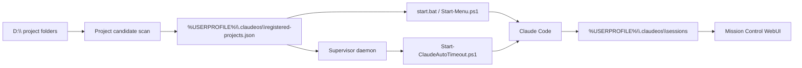

# Claude StartUpTools New Windows

Windows native launcher and supervisor for Claude Code autonomous development.

This repository is the Windows-focused successor of `ClaudeCode-StartUpTools-New`.
SSH, Linux cron, tmux, and bash runtime paths are no longer the primary execution
model. Legacy Linux assets are kept under `legacy-linux/` only for reference.

## Windows Operating Model

| 項目 | 現行値 |
|---|---|
| バージョン | **v4.0.0** |
| Agents | **44体** |
| Commands | **42コマンド** |
| Release mode | Windows native / human final decision |



| Area | Windows implementation |
|---|---|
| Project root | `config/config.json` -> `projectsDir`, default `D:\` |
| Candidate scan | `scripts/main/Register-ProjectCandidate.ps1 -Scan` |
| Project registry | `%USERPROFILE%\.claudeos\registered-projects.json` |
| Foreground launch | `scripts/main/Start-ClaudeCode.ps1` |
| Timed autonomous launch | `scripts/main/Start-ClaudeAutoTimeout.ps1` |
| Scheduling | `Register-AutoRunTask.ps1` using Windows Task Scheduler |
| Process supervisor | `supervisor-daemon.js` via `Register-SupervisorTask.ps1` |
| Dashboard | `npm run start:dashboard` or menu `MC` |

## Mission Control

Mission Control is the Windows control-tower view at
`http://127.0.0.1:3737/mission-control`.

| Panel | Windows release signal |
|---|---|
| Projects | D-drive candidates, registered projects, Supervisor targets, GitHub links, and AutoRun state |
| Supervisor | Daemon status, Windows Task Scheduler hint, and registered-project autonomy state |
| Jobs | Read-only diagnostics plus confirmed Windows management jobs |
| Health | Task Scheduler, auth, source-of-truth drift, and release-readiness checks |

## Quick Start

1. Copy `config/config.json.template` to `config/config.json`.
2. Adjust `projectsDir` if your project folders are not directly under `D:\`.
3. Run `start.bat`.
4. Use menu `12` to scan/register D-drive project candidates.
5. Use `L1` for foreground Claude launch, `S1` for a 5-hour autonomous session,
   or `14` to register a scheduled autonomous run.
6. Use `DR` to register the dashboard task and `MC` for Mission Control.
7. Use `Register-SupervisorTask.ps1 -RunNow` to start the Windows supervisor.

## Safety Rules

| Rule | Meaning |
|---|---|
| Human final decision | push, merge, release, destructive changes remain human choices |
| CTO delegated work | planning, implementation, tests, docs, and retries may be automated |
| No SSH runtime | remote SSH execution is removed from the Windows runtime path |
| No unverified merge | local tests and CI evidence must be visible before merge |
| Supervisor limits | registered project autonomy uses max concurrency and cooldowns |

## Core Commands

```powershell
.\start.bat
pwsh -File .\scripts\main\Register-ProjectCandidate.ps1 -Scan
pwsh -File .\scripts\main\Register-ProjectCandidate.ps1 -RegisterAll
pwsh -File .\scripts\main\Start-ClaudeCode.ps1 -Project MyProject -Local
pwsh -File .\scripts\main\Start-ClaudeAutoTimeout.ps1 -Project MyProject -DurationMinutes 300
pwsh -File .\scripts\main\Register-AutoRunTask.ps1 -Project MyProject -Status
pwsh -File .\scripts\main\Register-SupervisorTask.ps1 -RunNow
npm run start:dashboard
```

## Verification

```powershell
npm run test:pester
npm run test:node
npm run lint:pester
```

## Release Candidate Review

`v1.0.0` tag creation and GitHub Release publication are human-only final
actions. Development may prepare RC evidence, but it must not publish the final
release automatically.

| Document | Purpose |
|---|---|
| [release-candidate-checklist.md](docs/release-candidate-checklist.md) | Current RC evidence gate |
| [v1.0.0-rc.1-release-notes.md](docs/v1.0.0-rc.1-release-notes.md) | Release candidate notes |
| [rc-real-machine-verification.md](docs/rc-real-machine-verification.md) | Clean Windows and real project verification |
| [human-final-release-gate.md](docs/human-final-release-gate.md) | Human-only final tag/release checklist |

See [docs/WINDOWS-OPERATIONS.md](docs/WINDOWS-OPERATIONS.md) for the Windows
architecture and registry format. See
[docs/windows-migration-audit.md](docs/windows-migration-audit.md) for the
current release-readiness audit and remaining migration work.
