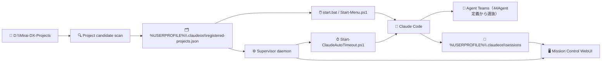
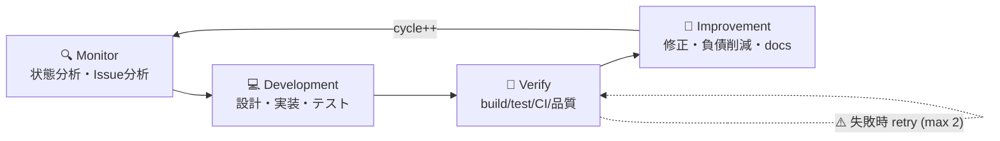

# 🪟 Claude StartUpTools New Windows

Windows native launcher and supervisor for Claude Code autonomous development.

This repository is the Windows-focused successor of `ClaudeCode-StartUpTools-New`.
SSH, Linux cron, tmux, and bash runtime paths are no longer the primary execution
model. Legacy Linux assets are kept under `legacy-linux/` only for reference.

## 📊 Windows Operating Model

| 項目 | 現行値 |
|---|---|
| バージョン | **v4.3.0** 🏷️ |
| Agents | **44体** 🤖 |
| ⌨️ Commands | **42コマンド** |
| 🧠 ClaudeOS カーネル | **44体+42コマンド**（`.claude/claudeos/`） |
| 🚀 Release mode | Windows native / human final decision |


```mermaid
flowchart LR
    D["📁 D:\\Mirai-DX-Projects"] --> Scan["🔍 Project candidate scan"]
    Scan --> Reg["🗂️ %USERPROFILE%\\.claudeos\\registered-projects.json"]
    Reg --> Menu["🖱️ start.bat / Start-Menu.ps1"]
    Reg --> Sup["⚙️ Supervisor daemon"]
    Menu --> Claude["🤖 Claude Code"]
    Sup --> Auto["⏱ Start-ClaudeAutoTimeout.ps1"]
    Auto --> Claude
    Claude --> Teams["👥 Agent Teams（44Agent定義から選抜）"]
    Claude --> Sessions["📄 %USERPROFILE%\\.claudeos\\sessions"]
    Sessions --> MC["🖥️ Mission Control WebUI"]
    Sup --> MC
```

| Area | Windows implementation |
|---|---|
| 📁 Project root | `config/config.json` -> `projectsDir`, default `D:\Mirai-DX-Projects` |
| 🔍 Candidate scan | `scripts/main/Register-ProjectCandidate.ps1 -Scan` |
| 🗂️ Project registry | `%USERPROFILE%\.claudeos\registered-projects.json` |
| 🖱️ Foreground launch | `scripts/main/Start-ClaudeCode.ps1` |
| ⏱ Timed autonomous launch | `scripts/main/Start-ClaudeAutoTimeout.ps1` |
| 📅 Scheduling | `Register-AutoRunTask.ps1` using Windows Task Scheduler |
| ⚙️ Process supervisor | `supervisor-daemon.js` via `Register-SupervisorTask.ps1` |
| 🖥️ Dashboard | `npm run start:dashboard` or menu `MC` |

## 🖥️ Mission Control (WebUI)

Mission Control is the Windows control-tower view. The dashboard binds
`0.0.0.0`, prints the auto-detected LAN IP, and **auto-selects a free port**
(preferred port busy → scans upward, max +20). The effective endpoint is
recorded in `~/.claudeos/dashboard-runtime.json` so the Supervisor health
check and other tools always follow the actually-bound port.

| 起動 | URL |
|---|---|
| 🏠 Local | `http://127.0.0.1:<port>/mission-control`（既定ポート 3737） |
| 🌐 LAN | `http://<auto-detected-ip>:<port>/mission-control`（起動ログと runtime file に表示） |

| Port selection | 優先順 |
|---|---|
| 1️⃣ | `--port <n>` / 裸の数値引数 |
| 2️⃣ | 環境変数 `DASHBOARD_PORT` |
| 3️⃣ | 既定 `3737`（使用中なら `3738…3757` を自動走査） |

| Panel | Windows release signal |
|---|---|
| 📋 Projects | D-drive candidates, registered projects, Supervisor targets, GitHub links, and AutoRun state |
| ⚙️ Supervisor | Daemon status, Windows Task Scheduler hint, and registered-project autonomy state |
| 🛠️ Jobs | Read-only diagnostics plus confirmed Windows management jobs |
| 💚 Health | Task Scheduler, auth, source-of-truth drift, and release-readiness checks |

### 🔒 WebUI security model

| 状態 | 閲覧 (GET) | 変更系 (POST/DELETE) |
|---|---|---|
| 🔑 `DASHBOARD_PASSWORD` / `config.json dashboardAuth` 設定時 | Basic Auth 必須 | Basic Auth 必須（SSE は短命トークン） |
| 🔓 認証未設定（既定） | LAN から閲覧可 | **loopback 限定**（LAN からは 403） |

## 🚀 Quick Start

1. 📄 Copy `config/config.json.template` to `config/config.json`.
2. 📁 Adjust `projectsDir` if your project folders are not under `D:\Mirai-DX-Projects`.
3. 🖱️ Run `start.bat`.
4. 🔍 Use menu `12` to scan/register project candidates.
5. ⏱ Use `L1` for foreground Claude launch, `S1` for a 5-hour autonomous session,
   or `14` to register a scheduled autonomous run.
6. 🖥️ Use `DR` to register the dashboard task and `MC` for Mission Control.
7. ⚙️ Use `Register-SupervisorTask.ps1 -RunNow` to start the Windows supervisor.

## 🔁 Autonomous Loop (Goal Rotation)

AutoRun sessions rotate four standing phase goals. Advancement is owned by the
launcher finalize (`goal-rotation.js`); the Supervisor restarts the next phase.


```mermaid
flowchart LR
    M["🔍 Monitor<br/>状態分析・Issue分析"] --> Dv["💻 Development<br/>設計・実装・テスト"]
    Dv --> V["🧪 Verify<br/>build/test/CI/品質"]
    V --> I["🧬 Improvement<br/>修正・負債削減・docs"]
    I -->|cycle++| M
    V -.->|"⚠️ 失敗時 retry (max 2)"| V
```

| Phase file | Scope |
|---|---|
| 📄 `.claude/goal/10-monitor.md` | 現状分析 / リスク分析 |
| 📄 `.claude/goal/20-development.md` | スコープ内実装 |
| 📄 `.claude/goal/30-verify.md` | Verification First |
| 📄 `.claude/goal/40-improvement.md` | 改善・ドキュメント |

## 🔒 Safety & Governance

| Rule | Meaning |
|---|---|
| 🤝 CTO delegated git ops | commit / push / PR / merge run autonomously once verification (tests / CI) passes and the auto-merge gate (`trust.level >= 2`) is satisfied |
| 👤 Human final decision | release declarations / tags, production deploy, force-push / history rewrites, destructive operations outside the repo, security exceptions |
| 🚫 No SSH runtime | remote SSH execution is removed from the Windows runtime path |
| 🧪 No unverified merge | local tests and CI evidence must be visible before merge |
| ⚙️ Supervisor limits | registered project autonomy uses max concurrency and cooldowns |
| 🛡️ Permissions floor | `.claude/settings.json` denies `rm -rf`, force-push, and drive-root recursive deletes even in autonomous runs |

## ⌨️ Core Commands

```powershell
.\start.bat
pwsh -File .\scripts\main\Register-ProjectCandidate.ps1 -Scan
pwsh -File .\scripts\main\Register-ProjectCandidate.ps1 -RegisterAll
pwsh -File .\scripts\main\Start-ClaudeCode.ps1 -Project MyProject -Local
pwsh -File .\scripts\main\Start-ClaudeAutoTimeout.ps1 -Project MyProject -DurationMinutes 300
pwsh -File .\scripts\main\Register-AutoRunTask.ps1 -Project MyProject -Status
pwsh -File .\scripts\main\Register-SupervisorTask.ps1 -RunNow
npm run start:dashboard          # 既定ポート 3737（使用中なら自動フォールバック）
node scripts/dashboards/serve-dashboard.js --port 8080   # 明示ポート
```

## 🧪 Verification

```powershell
npm run test:pester
npm run test:node
npm run lint:pester
```

## 📦 Release Candidate Review

`v1.0.0` tag creation and GitHub Release publication are human-only final
actions. Development may prepare RC evidence, but it must not publish the final
release automatically.

| Document | Purpose |
|---|---|
| 📋 [release-candidate-checklist.md](docs/release-candidate-checklist.md) | Current RC evidence gate |
| 📝 [v1.0.0-rc.1-release-notes.md](docs/v1.0.0-rc.1-release-notes.md) | Release candidate notes |
| 🖥️ [rc-real-machine-verification.md](docs/rc-real-machine-verification.md) | Clean Windows and real project verification |
| 👤 [human-final-release-gate.md](docs/human-final-release-gate.md) | Human-only final tag/release checklist |
| 🤝 [final-release-handoff.md](docs/final-release-handoff.md) | Final human-only release commands |

See [docs/WINDOWS-OPERATIONS.md](docs/WINDOWS-OPERATIONS.md) for the Windows
architecture and registry format. See
[docs/windows-migration-audit.md](docs/windows-migration-audit.md) for the
current release-readiness audit and remaining migration work.
