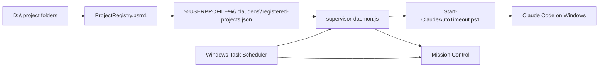

# Windows Migration Audit

Generated: 2026-06-07

## Session Restore Report

| Area | Status |
|---|---|
| Project | `Claude-StartUpTools-New-Windows` |
| GitHub | `Kensan196948G/Claude-StartUpTools-New-Windows` |
| Branch | `main` |
| Open issues | `0` |
| Active PRs | `0` |
| Latest CI status | No workflow runs yet |
| Local state | `state.json` is not present; `state.json.example` is the template |
| Decision | continue |
| Reason | Windows root is initialized, but template/docs/UI remnants still need migration before release |

## Executive Verdict

The active runtime is already Windows-first: PowerShell, Node.js, Windows Task
Scheduler, local project registry, and Mission Control. The old Linux runtime
has been moved under `legacy-linux/` and no active `.sh` file remains under the
current `scripts/` tree.

The release blocker is not a live SSH/tmux/bash executable path. The blocker is
documentation and template drift: several deployable ClaudeOS templates still
describe Linux cron, crontab, SSH, tmux, or `/home/kensan` paths. Those templates
must be rewritten or explicitly marked as legacy before `v1.0.0`.

## Current Runtime Boundary

## Scan Summary

Search scope excluded `legacy-linux/**`, `node_modules/**`, and
`package-lock.json`.

| Pattern | Hits | Interpretation |
|---|---:|---|
| `SSH` / `ssh` | 60 | Mostly old history, templates, and explicit "do not use" docs |
| `Linux cron` / `crontab` / `cron-launcher` | 70 | Template drift and compatibility registry/API names |
| `tmux` | 44 | Old history and templates |
| `bash` / `.sh` | 183 | Mostly markdown fences, old history, and scanner code |
| `/home/kensan` | 9 | Template drift that must be rewritten |
| `Linux` | 68 | Mixed legacy references, project names, and old template guidance |
| Active `.sh` files outside `legacy-linux/` | 0 | Pass |

## Classification

| Class | Files | Release Action |
|---|---|---|
| Active Windows runtime | `scripts/main/*.ps1`, `scripts/lib/*.psm1`, `scripts/dashboards/*.js`, `config/*.json.template` | Keep and harden |
| Compatibility names | `serve-dashboard.js` `/api/cron`, `cron-registry.json`, `hasCron` | Keep temporarily; UI must say AutoRun / Task Scheduler |
| Legacy source history | `CHANGELOG.md`, `ONBOARDING.md`, `TASKS.md` | Split into migration-source history or add a top notice |
| Deployable templates needing rewrite | `Claude/templates/claude/CLAUDE.md`, `Claude/templates/claudeos/commands/cron-*.md`, `work-time-reset.md`, `webhook-setup.md`, `parallel-cron-experiment.md`, review config docs | Rewrite for Windows or move to `legacy-linux/` |
| Explicit guardrails | `README.md`, `AGENTS.md`, `CLAUDE.md`, `docs/WINDOWS-OPERATIONS.md` | Keep; these correctly state no active SSH/Linux runtime |

## Findings

### P1: Deployable command templates still instruct Linux cron

Examples:

| File | Problem |
|---|---|
| `Claude/templates/claudeos/commands/cron-register.md` | Describes Linux crontab registration |
| `Claude/templates/claudeos/commands/cron-cancel.md` | Calls `/home/kensan/.claudeos/cron-cli.sh` |
| `Claude/templates/claudeos/commands/cron-list.md` | Uses `crontab -l` |
| `Claude/templates/claudeos/commands/work-time-reset.md` | Calls Linux `cron-cli.sh` |

Action: replace these with Windows AutoRun / Task Scheduler commands, or move
the old command set to `legacy-linux/Claude/templates/...`.

### P1: Main Claude template still claims Linux cron execution

`Claude/templates/claude/CLAUDE.md` still says autonomous execution is handled
by Linux cron. This is a deployable template, so it can misconfigure every
registered project.

Action: rewrite it to use `Start-ClaudeAutoTimeout.ps1`,
`Register-AutoRunTask.ps1`, and `registered-projects.json`.

### P2: Historical docs are not separated from Windows current state

`CHANGELOG.md`, `ONBOARDING.md`, and `TASKS.md` contain many correct historical
entries from the upstream Linux/tmux era. They are useful as migration evidence
but confusing as current Windows guidance.

Action: add a top-level migration notice now; later split source history into
`legacy-linux/docs/source-history/` if needed.

### P2: Mission Control terminology is mid-migration

The main UI now presents Windows and AutoRun labels, but internal API and data
names still use `cron` for compatibility. This is acceptable for Phase 1, but
the release UI should not expose `crontab`, Linux cron, or systemd references.

Action: keep `/api/cron` as an alias, add `/api/autorun` later, and migrate
visible text first.

### P3: Cross-platform comments remain in active scripts

Some comments mention Linux compatibility in Node smoke tests, supervisor, and
watcher scripts. These are not active Linux dependencies, but they should be
trimmed when the Windows-only release message is finalized.

## Release Gate Impact

| Gate | Current Result |
|---|---|
| No active `.sh` outside `legacy-linux/` | Pass |
| No active SSH helper module | Pass |
| No live tmux/bash launcher in Windows path | Pass |
| Windows Task Scheduler path present | Pass |
| D-drive registry present | Pass |
| Deployable templates Windows-only | Fail |
| Current docs separated from source history | Partial |
| Mission Control Windows terminology | Partial |

## Next Implementation Order

1. Rewrite deployable Claude templates for Windows AutoRun.
2. Add migration-source notice to `CHANGELOG.md`, `ONBOARDING.md`, and `TASKS.md`.
3. Add `/api/autorun` as an alias for `/api/cron` while keeping backward compatibility.
4. Expand Pester tests for `WindowsHost` / `Host` registry entries.
5. Re-run `npm test`, browser Mission Control check, and push.

